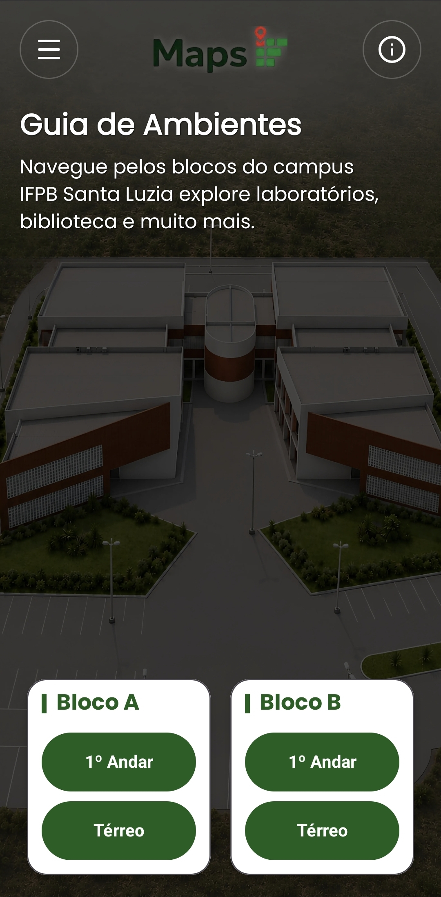

# MapsIF - Guia Interativo do IFPB Santa Luzia
<p align="center">
  
</p>

Projeto de Conclusão do Curso Técnico de Informática do IFPB Santa Luzia (turma 2024-2026). Aplicativo Android para tour virtual 360° do campus, desenvolvido por Lucas Emanuel Nóbrega de Macêdo e Iasmim Anahí Alves Silva, sob orientação do Prof. Dr. Antonio Alexandre Moura Costa.

## Equipe
- **Lucas Emanuel Nóbrega de Macêdo** - Desenvolvimento Android
- **Iasmim Anahí Alves Souza** - Desenvolvimento Android & UI/UX  
- **Dr. Alexandre Costa** - Orientador

## Como Usar

**Ambiente de Desenvolvimento:**
```bash
git clone https://github.com/macedo-hub/mapsif.git
cd mapsif
./gradlew assembleDebug  # Gera APK de debug
```

**Versão Beta (Futuro):**
APKs estarão disponíveis em [GitHub Releases] quando o app atingir estabilidade suficiente para testes externos.

## Tecnologias
- **Java** com Android SDK 37 (min 26)
- **Pannellum** - Visualização 360° via WebView
- **Material Design Components**
- **Lucide Icons** - Ícones
- **Glide** - Carregamento eficiente de imagens
- **Gradle Version Catalog** para gerenciamento de dependências

## Demonstração
<p align="center">
  
</p>
*Menu com navegação por blocos e andares*

<p align="center">
  
</p>
*Navegação em ambiente virtual interativo*

<p align="center">
  
</p>
*Seção com informações da equipe*